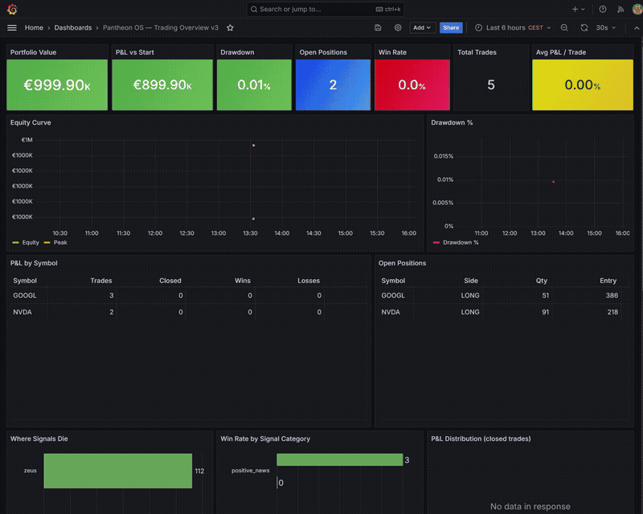

# Pantheon OS — Autonomous Trading Orchestrator


> **8-agent autonomous trading system. ZEUS is the supreme orchestrator — all agents report to it. Fully deployed on Hetzner, paper trading live, self-scheduling every 15 minutes. Signal production runs as a separate decoupled container (Hermes Producer) writing EDGAR + Finnhub intelligence directly into Supabase every 30 minutes.**

---


---

## Live Dashboard



Real-time Grafana dashboard auto-refreshing every 30 seconds. Panels include:

- **Portfolio** — equity curve, drawdown %, P&L vs start, open positions
- **Trade stats** — P&L by symbol (wins/losses/avg/best/worst), recent trades feed
- **Pipeline** — where signals die, win rate by category, P&L distribution, 24h activity
- **Seniority** — per-agent level, system level, live trading gate, promotion history
- **Agent health** — live status of all 8 agents with last-check timestamps

---

## Live URLs

| Service | URL |
|---|---|
| API health | `https://moremanamoreproblems.de/api/health` |
| Agent status | `https://moremanamoreproblems.de/api/agents` |
| Grafana dashboard | `https://moremanamoreproblems.de/grafana/d/pantheon-overview` |
| WebSocket feed | `wss://moremanamoreproblems.de/ws` |
| React dashboard (CDN) | Cloudflare Pages (see GitHub secrets) |

---

## Architecture

```
  ┌─────────────────────────────────────────────────────────────┐
  │  Hermes Producer (own container — every 30 min)             │
  │  EDGAR 8-K/10-Q/10-K + Finnhub company news                │
  │  Quality gate: drops tickerless signals + LOW urgency noise │
  │  Writes → Supabase `signals` table                         │
  └──────────────────────────┬──────────────────────────────────┘
                             │ (Icarus reads from DB)
  [1] Icarus  — Signal Watcher
        ↓  RawSignal
  [2] Hades   — Compliance Filter      ← OFAC · EU sanctions · ESG · LkSG
        ↓  FilteredSignal (or KILL)
  [3] Artemis — Macro Context          ← VIX · S&P500 regime · sector ETFs
        ↓  MacroContext (or SUPPRESS)
  [4] Pythia  — Pattern & Sizing       ← Supabase hit rates → Kelly-sized positions
        ↓  SizedSignal (or SKIP)
  [5] ZEUS    — LLM Reasoning          ← Claude Sonnet · ChromaDB KB · past decisions
        ↓  approved / resized / rejected
  [6] Ares    — Trade Execution        ← IBKR bracket order (entry + SL + TP)
        ↓  TradeResult
  [7] Argus   — Portfolio Monitor      ← drawdown kill switch · Telegram alerts
        ↓  outcome → Pythia + KB (feedback loop)

  [Apollo] — Daily research cycle + one-shot historical bootstrap
     ├── arXiv q-fin paper ingestion → ChromaDB
     ├── Ticker map maintenance → data/ticker_map.json
     ├── Self-improvement loop → analyses traces → updates zeus_skills.md
     └── Historical ingestion (POST /run/research/historical):
         ├── 4 years earnings history (yfinance) → ChromaDB
         ├── SEC Form 4 insider transactions (EDGAR) → ChromaDB
         ├── FRED macro series (Fed Funds, yield curve, credit spreads) → ChromaDB
         └── SEC 8-K supply chain events (EDGAR full-text) → ChromaDB

  Upstash Redis bridge → SpendLens (procurement intelligence platform)
     ├── zeus:macro:latest          — live market regime
     ├── zeus:decisions:recent      — ZEUS trade decisions (last 50)
     └── zeus:supplier_risk:{slug}  — Hades compliance per vendor
```

**ZEUS** owns the entire pipeline. No agent communicates with another directly. Only `zeus.py` imports from `agents/*`. All agents import from `core.types` only.

---

## Agents

| # | Agent | Mythology | Role |
|---|---|---|---|
| 1 | **Icarus** | Flies closest to the sun — first to see market signals | Reads signals from Supabase (written by Hermes Producer). Classifies events by category and severity. Deduplicates across poll cycles. Learns which signal patterns Zeus consistently rejects and suppresses them before they burn an LLM call. |
| 2 | **Hades** | Lord of the underworld — judges who passes | Compliance firewall. OFAC, EU sanctions (BaFin/Reg 833/2014), ESG sector flags, LkSG violations → hard kill or severity downgrade. Full audit trail. |
| 3 | **Artemis** | Goddess of the hunt — tracks conditions, picks the moment | Fetches VIX, S&P 500 1-month return, and 6 sector ETFs. Classifies market regime (bull/bear/sideways). Suppresses signals that conflict with macro environment. 15-min cache. |
| 4 | **Pythia** | Oracle of Delphi — reads patterns, predicts outcomes | Learning agent. Every signal → outcome in Supabase. Derives position size from historical hit rates per `{category}×{regime}×{VIX band}`. Kelly-inspired sizing (capped at 5%). |
| 5 | **ZEUS** | King of Olympus — final word | LLM reasoning via Claude Sonnet. Queries ChromaDB knowledge base. Approves, resizes, or rejects trades with structured JSON rationale. |
| 6 | **Ares** | God of decisive action — executes the strike | Places bracket orders on Interactive Brokers via `ib_async`. Entry + 3% stop-loss + 6% take-profit. Paper port 4002. |
| 7 | **Argus** | Hundred-eyed giant — watches everything, never sleeps | Tracks portfolio equity and drawdown in real time. Emergency halt + Telegram alert if drawdown ≥ 8%. Backfills closed-trade P&L into Pythia and ChromaDB. |
| 8 | **Apollo** | God of knowledge and truth — the librarian | Runs daily: ingests arXiv q-fin papers, maintains the live ticker map, runs the self-improvement loop. One-shot historical bootstrap loads 4 years of data before paper trading begins. |

---

## Infrastructure

| Component | Detail |
|---|---|
| **Server** | Hetzner VPS — Ubuntu 24.04, 2 vCPU, 4 GB RAM (`187.124.14.81`) |
| **Domain** | `moremanamoreproblems.de` → SSL via Let's Encrypt |
| **Containers** | `zeus` · `hermes-producer` · `dashboard` · `grafana` · `ibgateway` · `redis` · `kafka` · `nginx` · `autoheal` |
| **Image registry** | GitHub Container Registry (`ghcr.io/eugnmueller-87/pantheon`) |
| **Database** | Supabase (PostgreSQL + pgvector) |
| **Cache** | Upstash Redis — shared with SpendLens via RedisBridge |
| **CDN** | Cloudflare Pages — React dashboard |
| **Monitoring** | Grafana — live trading dashboard, reads Supabase directly |
| **CI/CD** | GitHub Actions: test → build (GHCR) → deploy (SSH) → Cloudflare Pages |

---

## Signal Production (Hermes Producer)

Hermes Producer runs as its own container with its own failure domain — a crash there does not affect the Zeus pipeline. Every 30 minutes it:

1. Fetches EDGAR filings (8-K, 10-Q, 10-K) for S&P 500 companies via the SEC EDGAR full-text API
2. Fetches Finnhub company-specific news (earnings, M&A)
3. Applies a quality gate — drops signals with no `affected_tickers` and drops `urgency == LOW` noise
4. Upserts surviving signals into Supabase `signals` table with `consumed_by_icarus = false`

Icarus polls that table every pipeline cycle. When Zeus processes a signal it is marked `consumed_by_icarus = true`.

---

## CI/CD Pipeline

Every push to `main`:

```
test (346 passing) → build → push to GHCR → SSH deploy to Hetzner → Cloudflare Pages (frontend)
```

The deployed compose file is `infra/hetzner/docker-compose.prod.yml`. The root `docker-compose.prod.yml` is a local-build variant (for manual VPS runs). Edit `infra/hetzner/` for all production changes.

---

## Tech Stack

| Component | Tool |
|---|---|
| Orchestration | `zeus.py` (plain Python — no LangGraph, no LangChain) |
| Signal source | EDGAR full-text API + Finnhub (via `hermes_local.py`) |
| Market data | yfinance — VIX, SPY, sector ETFs |
| Macro data | FRED API (St. Louis Fed) — Fed Funds, yield curve, credit spreads, VIX |
| Knowledge base | ChromaDB — local persistent vector store |
| Trade memory | Supabase PostgreSQL |
| LLM reasoning | Claude Sonnet 4.6 — ~$0.01/call, structured JSON output |
| Execution | Interactive Brokers via `ib_async` (paper port 4002) |
| Alerts | Telegram Bot API |
| Intelligence bridge | Upstash Redis — shared with SpendLens |
| CDN | Cloudflare Pages — React dashboard |
| Reverse proxy | nginx — SSL termination, subpath routing |
| Monitoring | Grafana 11 — provisioned dashboards, Supabase datasource |

---

## Quickstart (local dev)

### 1. Install dependencies

```bash
pip install -r requirements.txt
```

### 2. Configure environment

Copy `.env.example` to `.env` and fill in:

```env
# LLM
ANTHROPIC_API_KEY=sk-ant-...

# Signal production
FINNHUB_API_KEY=
EDGAR_USER_AGENT=your.email@example.com

# Cache + SpendLens bridge
UPSTASH_REDIS_REST_URL=https://...
UPSTASH_REDIS_REST_TOKEN=...

# Alerts
TELEGRAM_BOT_TOKEN=
TELEGRAM_CHAT_ID=

# Database
SUPABASE_URL=https://...supabase.co
SUPABASE_ANON_KEY=
SUPABASE_SERVICE_ROLE_KEY=

# Macro data — free at fred.stlouisfed.org/docs/api/api_key.html
FRED_API_KEY=

# IBKR (paper trading — leave empty until account approved)
IB_HOST=ibgateway
IB_PAPER_PORT=4002
```

### 3. Run tests

```bash
pytest tests/ -q
# 346 tests, all green
```

### 4. Produce signals (run once to seed, then runs every 30 min in prod)

```bash
python run_hermes_producer.py
# Or one-shot: python -m agents.hermes_local
```

### 5. Bootstrap historical knowledge base (run once before paper trading)

```bash
curl -X POST http://localhost:8080/run/research/historical
# Loads 4 years of earnings, insider trades, FRED macro, and 8-K supply chain events
```

### 6. Start the pipeline server

```bash
python main.py
# ZEUS listens on http://localhost:8080, auto-runs every 15 min
```

### 7. Start the dashboard

```bash
cd dashboard/frontend && npm install && npm run dev
# Dashboard → http://localhost:5173
```

---

## API Endpoints

| Method | Path | Description |
|---|---|---|
| `POST` | `/run` | Trigger one pipeline cycle (Icarus → Argus) |
| `POST` | `/run/research` | Trigger Apollo's daily research cycle |
| `POST` | `/run/research/historical` | One-shot bootstrap — load 4 years of historical data into KB |
| `POST` | `/halt` | Emergency halt — cancels pending orders |
| `POST` | `/resume` | Resume after halt |
| `GET` | `/status` | Portfolio equity, drawdown, circuit breaker states |
| `GET` | `/health` | Liveness check |
| `GET` | `/api/agents` | Watchdog health report for all 8 agents |

---

## Pipeline Kill Switches

| Trigger | Action |
|---|---|
| Portfolio drawdown ≥ 8% | Emergency halt + Telegram alert |
| OFAC / EU sanctions match | Signal killed at Hades, logged for audit |
| ESG / LkSG flag | Signal severity downgraded |
| VIX ≥ 35 | All signals suppressed |
| Bear regime + high VIX | Positive signals suppressed |
| Agent failure (3 restarts) | Watchdog alert + graceful degradation via circuit breaker |
| `POST /halt` | Manual halt via API |

---

## Grafana Dashboard

Live at `https://moremanamoreproblems.de/grafana/` — provisioned automatically, reads Supabase directly.

| Panel | What it shows |
|---|---|
| Equity Curve | Total equity + peak over 7 days |
| Current Drawdown % | Live gauge with red/yellow/green thresholds |
| Total Equity | Latest value in € |
| Win Rate by Category | Historical win % per signal category |
| Kill Stage Distribution | Where signals die (Hades / Artemis / Pythia / Ares) |
| Agent Health | All 8 agents with live status and last-check timestamp |
| Recent Trades | Last 50 trades, WIN/LOSS/OPEN color-coded |
| Monthly Returns | Win rate + avg P&L % by month |
| Agent Seniority Levels | Per-agent level, score, live-trading clearance |
| System Seniority | Current system-wide level (TRAINEE → DIRECTOR) |
| Anthropic Budget Used | Gauge — cumulative spend vs $25 budget |
| Budget Remaining | Dollar amount left before manual top-up needed |
| Daily LLM Cost | Time-series — daily Anthropic API spend |
| Token Usage by Symbol | Which tickers are driving LLM cost |

---

## Project Structure

```
ZEUS/
├── main.py                      # Webhook server + auto-run scheduler (900s)
├── run_hermes_producer.py       # Standalone signal producer entrypoint (1800s loop)
├── requirements.txt
├── Dockerfile
├── agents/
│   ├── zeus.py                  # Supreme orchestrator — owns the pipeline
│   ├── icarus.py                # Signal watcher — reads from Supabase
│   ├── hades.py                 # Compliance filter — OFAC, ESG, EU sanctions
│   ├── artemis.py               # Macro context — VIX, regime, sector momentum
│   ├── pythia.py                # Pattern learning — Kelly-sized positions
│   ├── ares.py                  # Trade execution — IBKR live/paper
│   ├── ares_mock.py             # Mock execution — no IB needed
│   ├── argus.py                 # Portfolio monitor — drawdown kill switch
│   ├── apollo.py                # Research — KB seeding + self-improvement
│   ├── apollo_historical.py     # One-shot bootstrap — 4 years historical data
│   └── hermes_local.py          # Signal fetcher — EDGAR + Finnhub → Supabase
├── core/
│   ├── types.py                 # Single source of truth for all data contracts
│   ├── knowledge_base.py        # ChromaDB wrapper (shared KB) — idempotent ingestion
│   ├── agent_knowledge.py       # Per-agent private skills KB
│   ├── circuit_breaker.py       # Per-agent fault isolation
│   ├── seniority.py             # Agent seniority evaluation
│   ├── watchdog.py              # Agent health daemon + auto-restart
│   └── redis_bridge.py          # ZEUS → SpendLens intelligence feed
├── config/
│   └── settings.py              # All risk params — stop loss, take profit, VIX thresholds
├── dashboard/
│   ├── backend/server.py        # FastAPI WebSocket backend (port 8081)
│   └── frontend/                # React + Vite dashboard (Cloudflare Pages)
├── infra/
│   └── hetzner/
│       ├── docker-compose.prod.yml   # ← DEPLOYED FILE (deploy.yml uses this)
│       ├── nginx.prod.conf
│       └── grafana/             # Provisioned datasource + dashboards
├── knowledge/
│   ├── agents/                  # Per-agent Senior IC skills files
│   └── *.md                     # Trading fundamentals, macro playbooks
├── tests/                       # 346 tests — full pipeline coverage
└── .github/workflows/deploy.yml # CI/CD pipeline
```

---

## SpendLens Integration

ZEUS writes live intelligence to a shared Upstash Redis instance, readable by [SpendLens](https://github.com/eugnmueller-87/PROCUREMENT).

```
ZEUS pipeline run
  → Hades assesses supplier      → zeus:supplier_risk:{slug}
  → Artemis classifies macro     → zeus:macro:latest
  → ZEUS approves/rejects trade  → zeus:decisions:recent (last 50)
```

---

## External APIs

| API | Purpose |
|---|---|
| Anthropic | Claude Sonnet 4.6 LLM reasoning |
| SEC EDGAR | 8-K / 10-Q / 10-K filings — primary signal source |
| Finnhub | Company news — earnings, M&A, analyst upgrades |
| Supabase | PostgreSQL + pgvector decision store |
| Upstash Redis | Cache + SpendLens intelligence bridge |
| Telegram Bot | Trade alerts + drawdown notifications |
| FRED (St. Louis Fed) | Macro series — Fed Funds, yield curve, credit spreads |
| Interactive Brokers | Trade execution — paper port 4002 |
| Cloudflare Pages | React dashboard CDN |

---

## Roadmap

### Done
- [x] 8-agent pipeline (Icarus → Hades → Artemis → Pythia → ZEUS → Ares → Argus + Apollo)
- [x] Supabase PostgreSQL — tables, pgvector, RLS for service_role
- [x] Circuit breakers + Watchdog daemon (zero-outage design)
- [x] Claude Sonnet 4.6 LLM reasoning in ZEUS with ChromaDB KB + ticker history
- [x] CI/CD — GitHub Actions, auto-deploy to Hetzner via GHCR
- [x] Docker image on GHCR, production stack on Hetzner VPS
- [x] SSL + domain (`moremanamoreproblems.de`) via Let's Encrypt + nginx
- [x] Grafana monitoring — provisioned dashboards, live Supabase connection
- [x] Executive dashboard — React + FastAPI WebSocket
- [x] Upstash Redis bridge → SpendLens intelligence feed
- [x] Apollo daily research cycle (arXiv, ticker map, self-improvement)
- [x] Senior IC identity framework — all agent skills files
- [x] Config centralization — all risk params in `config/settings.py`
- [x] Historical ingestion bootstrap — 4 years earnings, Form 4, FRED macro, EDGAR 8-K
- [x] IB Gateway connected — headless paper trading, port 4002, autoheal watchdog
- [x] Kafka event bus — signal replay, 7-day retention
- [x] Pipeline self-scheduling — runs every 15 minutes autonomously
- [x] Agent seniority system — TRAINEE → DIRECTOR progression, live trading gate
- [x] Anthropic token/cost tracking — per-call USD cost logged to Supabase + Grafana
- [x] Hermes replaced with local EDGAR + Finnhub fetcher (no Railway dependency)
- [x] Hermes Producer decoupled as own container — own failure domain
- [x] Signal quality gate — drops tickerless signals + LOW urgency noise before Supabase
- [x] Per-ticker concentration cap + cooldown (max 1 open position per ticker, 48h cooldown)
- [x] Atlas universe screener (Phase 2, dark — `universe_screener_enabled: false`)
- [x] ATR-based volatility stops (Phase 3, dark — `use_atr_stops: false`)

### In Progress
- [ ] First paper trade — pipeline is live and processing signals; waiting for a high-conviction approval
- [ ] Trade history accumulation — agents levelling up from TRAINEE as paper trades close
- [ ] Win rate → seniority → live trading unlock (target: Senior across all agents)

### Next
- [ ] Activate Phase 2 (Atlas universe screener) once first trades close
- [ ] Activate Phase 3 (ATR stops) after screener validation
- [ ] Live trading — flip `paper_trading=false` once seniority gates clear

---

## Notes

- **Germany-based**: Alpaca does not support German residents. Interactive Brokers (IBKR) is the execution layer — EU-regulated, German tax-compliant.
- **Paper trading by default**: `"paper_trading": true` and `"mock_execution": true` in settings. No real money at risk until explicitly opted in.
- **Signal production is decoupled**: `hermes-producer` container is independent from `zeus`. A producer crash does not affect the pipeline, and vice versa.
- **Run historical bootstrap first**: Before paper trading, run `POST /run/research/historical` to seed the KB with 4 years of patterns. Pythia needs this foundation.
- **Two compose files**: `infra/hetzner/docker-compose.prod.yml` is what deploy.yml ships. The root `docker-compose.prod.yml` uses `build:` and is for manual VPS runs only.
- **Vault rule**: Vault money only moves one direction — into it, never back to trading. ZEUS never moves Vault money autonomously.

---

*Built by [Eugen Mueller](https://github.com/eugnmueller-87) — Procurement Leader → AI Engineer*
